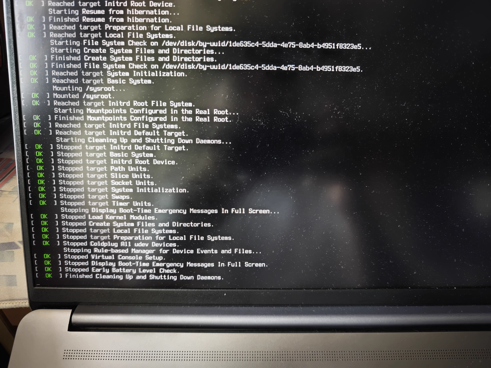
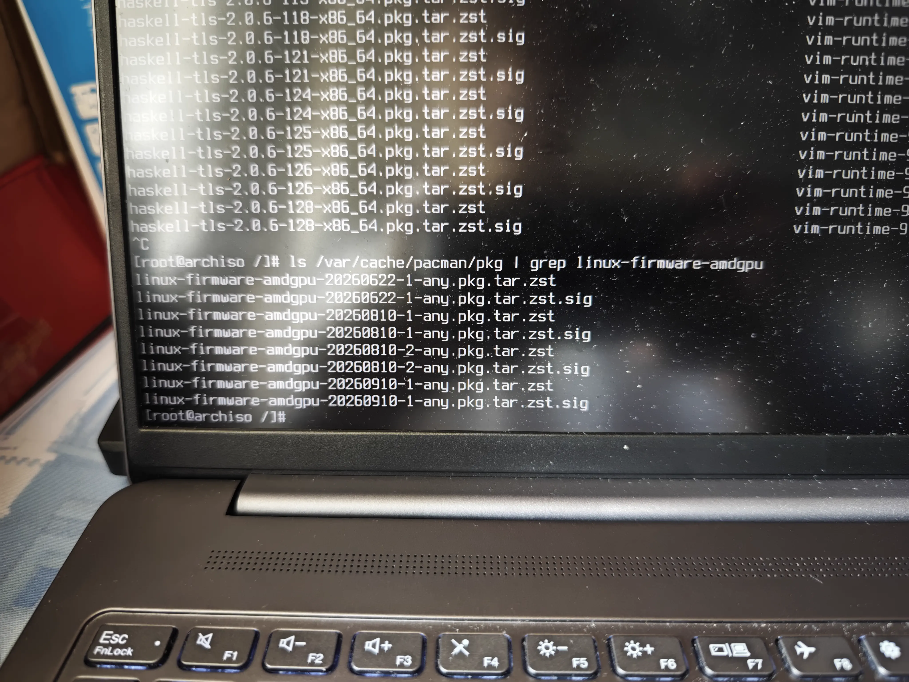
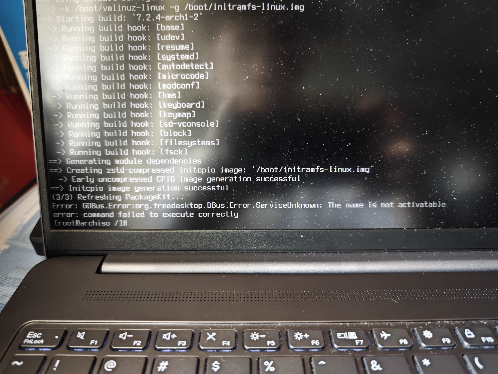

# amdgpu固件导致的启动失败
[amdgpu 20260910-1 fails on RDNA 2 Rembrandt (YELLOW_CARP)](https://gitlab.archlinux.org/archlinux/packaging/packages/linux-firmware/-/work_items/52)
"after updating to linux-firmware-amdgpu 20260910-1, My HP laptop with AMD Ryzen 7 PRO 6850HS with Radeon Graphics CPU will boot into a frozen screen at systemd boot log messages. Switching tty with Ctrl-Alt-Fn did not unfreeze the screen."
"Kernel log of the frozen screen boot is spammed with these amdgpu errors, see below for full kernel log:"
```bash
9月 12 14:46:52 archlinux kernel: amdgpu 0000:63:00.0: [drm] *ERROR* dc_dmub_srv_log_diagnostic_data: DMCUB error - collecting diagnostic data
9月 12 14:46:52 archlinux kernel: amdgpu 0000:63:00.0: [drm] *ERROR* dc_dmub_srv_log_diagnostic_data: DMCUB error - collecting diagnostic data
9月 12 14:46:53 archlinux kernel: amdgpu 0000:63:00.0: [drm] *ERROR* dc_dmub_srv_log_diagnostic_data: DMCUB error - collecting diagnostic data
9月 12 14:46:53 archlinux kernel: amdgpu 0000:63:00.0: [drm] *ERROR* dc_dmub_srv_log_diagnostic_data: DMCUB error - collecting diagnostic data
9月 12 14:46:53 archlinux kernel: amdgpu 0000:63:00.0: [drm] *ERROR* Error queueing DMUB command: status=2
9月 12 14:46:53 archlinux kernel: amdgpu 0000:63:00.0: [drm] *ERROR* dc_dmub_srv_log_diagnostic_data: DMCUB error - collecting diagnostic data
9月 12 14:46:53 archlinux kernel: amdgpu 0000:63:00.0: [drm] *ERROR* Error queueing DMUB command: status=2
9月 12 14:46:53 archlinux kernel: amdgpu 0000:63:00.0: [drm] *ERROR* dc_dmub_srv_log_diagnostic_data: DMCUB error - collecting diagnostic data
9月 12 14:46:53 archlinux kernel: amdgpu 0000:63:00.0: [drm] *ERROR* Error queueing DMUB command: status=2
9月 12 14:46:53 archlinux kernel: amdgpu 0000:63:00.0: [drm] *ERROR* dc_dmub_srv_log_diagnostic_data: DMCUB error - collecting diagnostic data
9月 12 14:46:54 archlinux kernel: amdgpu 0000:63:00.0: [drm] *ERROR* Error queueing DMUB command: status=2
```
[Issues with linux-firmware-amdgpu 20260910-1](https://bbs.archlinux.org/viewtopic.php?pid=2309499#p2309499)
"Hello! I recently updated to linux-firmware-amdgpu 20260910-1 on my computer and noticed that on boot, it was giving me a bunch of DMUB errors on start up, about 200ish once investigated. It returned "(date and time) (devicename) kernel: amdgpu 0000:04:00.0: [drm] *ERROR* dc_dmub_srv_log_diagnostic_data: DMCUB error - collecting diagnostic data" over 200 times in quick secession, especially on boot. I myself have a AMD Radeon 680M [Integrated] GPU. The only way I've been able to fix it is by downgrading the package to 20260810-2, which was before my system-wide update. I figured I'd post this in case anyone else with an AMD Radeon 680M is experiencing the same thing..."

我的电脑在更新后重启也是毫不例外地中招了...


# Live USB + chroot 救援
1. 从`Live USB`启动计算机
- 进入BIOS/UEFI设置从识别到的Live USB启动
2. 使用`iwctl`连接可使用的无线网络(或者通过连接RJ45网口接通有线网络)
- 进入Live环境后使用iwctl操作接通网络避免在Cache里找不到可以downgrade的固件包
~~~bash
iwctl
device list
//显示的即为网卡名称 以 wlan0举例
station wlan0 scan
station wlan0 get-networks
// 扫描可用的 wifi 网络
station wlan0 connect "WIFI名称"
// 回车后会提示输入密码
exit
ping -c 3 www.bing.com
// 测试网络是否已经连通
~~~
3. 挂载使用`Btrfs`文件系统的分区，使用子卷的挂载命令
首先使用`lsblk -f`查看硬盘分区情况(这里nvme0n1p1为boot分区，nvme0n1p3为Btrfs分区)。

第一步：挂载 Btrfs 根子卷`@`
```bash
mount -o subvol=@ /dev/nvme0n1p3 /mnt
```

第二步：挂载 Boot 分区
```bash
mkdir -p /mnt/boot
mount /dev/nvme0n1p1 /mnt/boot
```

第三步：挂载 Home 子卷`@home`(可选)
```bash
mkdir -p /mnt/home
mount -o subvol=@home /dev/nvme0n1p3 /mnt/home
```

第四步：检查挂载结果
输入`lsblk`或`df -h`确认挂载点无误。

第五步：进入 Chroot 并降级
```bash
arch-chroot /mnt
```
接下来就可以在`chroot`环境下降级固件了
```bash
# 查看缓存或下载旧版
ls /var/cache/pacman/pkg | grep linux-firmware-amdgpu
# 如果缓存里有：
pacman -U /var/cache/pacman/pkg/linux-firmware-amdgpu-20260810-1-x86_64.pkg.tar.zst
# 如果没有，从存档库下载：
wget https://archive.archlinux.org/packages/l/linux-firmware-amdgpu/linux-firmware-amdgpu-20260810-1-x86_64.pkg.tar.zst -O /tmp/old-amdgpu.pkg.tar.zst
# 最后别忘了重建 initramfs
mkinitcpio -P
```



第六步：卸载并退出重启
```bash
exit
umount -R /mnt
reboot
```

